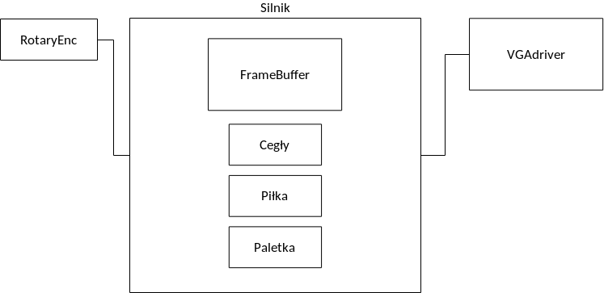
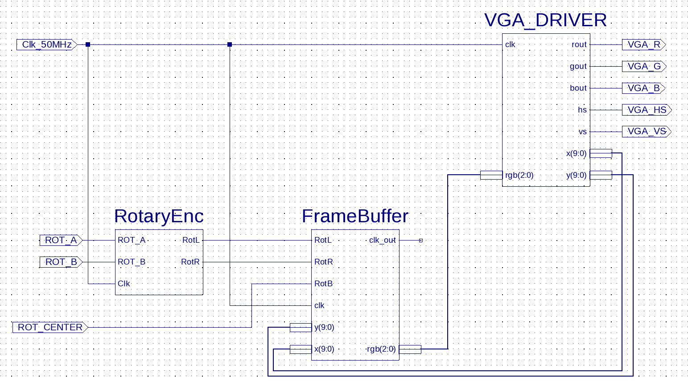

## Wstęp

## Założenia projektu

## Architektura systemu

Prace nad projektem zostały rozpoczęte od zaprojektowania architektury systemu.
Jako najwyższy poziom abstrakcji został przyjęty schemat łączący moduły funkcjonalne.

Na pierwszym etapie prac powstał ogólny pomysł architektury przedstawiony na
schemacie (Rysunek \ref{schemat1}). Ostateczny schemat implementowanego projektu
(Rysunek \ref{schemat2}) jest bardzo zbliżony do oryginalnego pomysłu.

W dalszej części akapitu zostały opisane elementy zawarte na rysunku.

### RotaryEnc

Jest to moduł który pełni rolę kontrolera gry. Pobrany został ze strony:

> http://www.zsk.ict.pwr.wroc.pl/zsk_ftp/fpga/

pod podanym adres również dostępna jest jego dokumentacja.

### FrameBuffer

Moduł ten jest odpowiedzialny za całą fizykę gry. Odpowiedzialny jest za
poruszanie piłką, wykrywanie kolizji oraz przenoszenie rakietki. Na podstawie
obliczanych sygnałów jest również konstruowany obraz przekazywany do kolejnego modułu.

### VGAdriver

Jest to podstawowy sterownik dla monitora VGA.

## Osiągnięte rezultaty

W ramach projektu została przygotowana w pełni działająca gra typu Arkanoid.
Zadaniem gracza jest odbijanie piłeczki za pomocą rakietki w celu zbicia
wszystkich bloków znajdujących się w górnej części planszy.
Gracz może poruszać paletką, oraz resetować grę ustawiając początkową pozycję pierwszego odbicia (serwis). W przypadku gdy piłka uderzy o ścianę na której znajduje się paletka gracz przegrywa.

### Rysowanie obiektów

Wszystkie obiekt rysowane są na ekranie monitora.
Procedura polega na badaniu aktualnego położenia wskaźnika rysowania
(pochodzącego z bloku VGAdriver) a następnie wyznaczeniu koloru na jaki dany piksel
ma być pokolorowany.

### Sterowanie paletką

Sterowania paletką polega na interpretacji sygnałów pochodzących z przycisku obrotowego.
w zależności od kierunku obrotu paletka jest przemieszczana w prawo lub lewo.
Gracz ma możliwość zmiany kierunku lotu piłki przy odbiciu, w zależności od
połowy paletki na której piłka wyląduje. Dla ułatwienia połówki są pokolorowane.

### Odbicia piłki

Piłka natrafiając na różne obiekty zmienia kierunek swojego lotu. Obijając się
od ścian bocznych zmienia kierunek poziomy, natomiast przy odbiciu od ściany górnej
lub bloczków zmienia kierunek pionowy.

### Zbijanie bloczków

W systemie bloczki zdefiniowane są jako wektor sygnałów (`std_logic_vector`).
Bloczki ułożone są w macierz. Po uderzeniu piłki sygnał zostaje wyłączony,
powodując zniknięcie bloczka.

### Zakończenie i resetowanie gry

W sytuacji w której wszystkie bloczki zostaną zbite, gracz może kontynuować odbijanie
lub zresetować grę klikając środkowy przycisk. Możliwe jest również resetowanie
gry przez nie odbicie piłki (tak zwana przegrana gry).

## Wyciągnięte wnioski

### Planowanie architektury

W oryginalnym schemacie zaplanowanych było utworzenie większej ilości modułów.
W trakcie implementacji okazało się, że w aplikacji często pojawiają się błędy.
Zidentyfikowane zostało zjawisko wyścigu. Sygnały były przestawiane przez wiele
procesów, przykładowo powodując odbijanie się piłki w jednym miejscu. Rozwiązaniem
okazało się połączenie całej logiki do jednego bloku i operowanie na zmiennych,
tworząc tylko jedno przypisanie do sygnałów zewnętrznych w osobnym procesie.

### Zagnieżdżanie instrukcji warunkowych

Podczas syntezy zauważono błąd polegajacy na przepełnianiu pamięci narzędzia
syntezy. Kod odpowiedzialny za błąd wyglądał następująco:

~~~
FOR c IN 0 to 7 LOOP
FOR r IN 0 to 4 LOOP
IF blocks(r * 8 + c) = '1' THEN
IF cballY >= 50 + (40 * r) AND
cballY < 50 + (40 * r) + BLOCK_H THEN
IF cballX >= 50 + (65 * c) AND
cballX < 50 + (65 * c) + BLOCK_W THEN
blocks(r * 8 + c) <= '0';
ballKierunekY := NOT ballKierunekY;
END IF;
END IF;
END IF;
END LOOP;
END LOOP;
~~~

Ponieważ instrukcje warunkowe są zagnieżdżone wewnątrz siebie i nie występują
alternatywy (`else`) możliwe było sformułowanie wyrażenia jako formułę logiczną.
Każdy `if` został zamieniony na instrukcję `AND`. Pamiętając o ograniczeniu wymagającym
stosowania jedynie koniunkcji (`and`) konieczne było wprowadzenie wyrażenia
stosując tożsamości logiczne (w szczególności `Prawo De Morgana`). Następnie ta sama
funkcja została zapisana w następujący sposób:

~~~
FOR c IN 0 TO 3 LOOP
FOR r IN 0 TO 3 LOOP
IF NOT (
NOT (
cballX >= 50 + (BLOCK_SPAN_X * c) AND
cballX < 50 + (BLOCK_SPAN_X * c) + BLOCK_W
) AND NOT (
cballX + BALL_W >= 50 + (BLOCK_SPAN_X * c) AND
cballX + BALL_W < 50 + (BLOCK_SPAN_X * c) + BLOCK_W)
) AND NOT (
NOT (
cballY >= 50 + (BLOCK_SPAN_Y * r) AND
cballY < 50 + (BLOCK_SPAN_Y * r) + BLOCK_H
) AND NOT (
cballY + BALL_H >= 50 + (BLOCK_SPAN_Y * r) AND
cballY + BALL_H < 50 + (BLOCK_SPAN_Y * r) + BLOCK_H
)
) AND blocks(r * 4 + c) = '1' THEN
blocks(r * 4 + c) <= '0';
ballKierunekY := NOT ballKierunekY;
END IF;
END LOOP;
END LOOP;
~~~

Po modyfikacji narzędzie syntezy znacznie przyspieszyło pracę oraz zwolnione zostały
niepotrzebnie wcześniej zajmowane zasoby.

## Literatura
